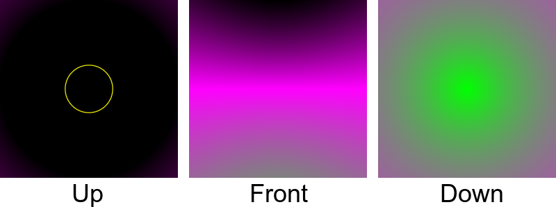
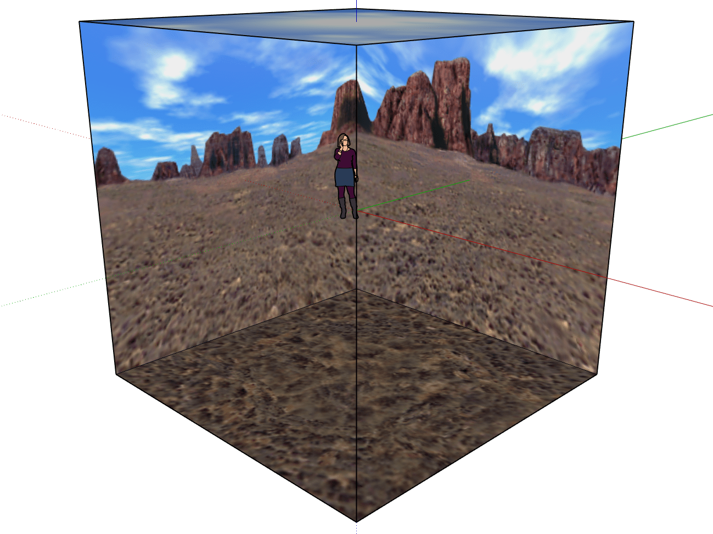
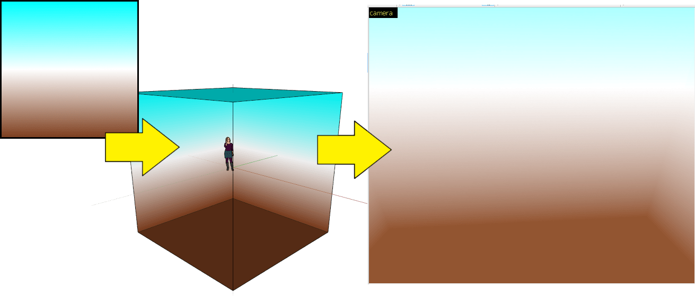
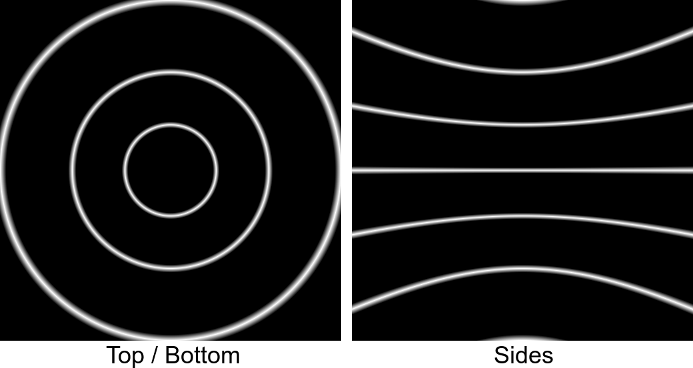
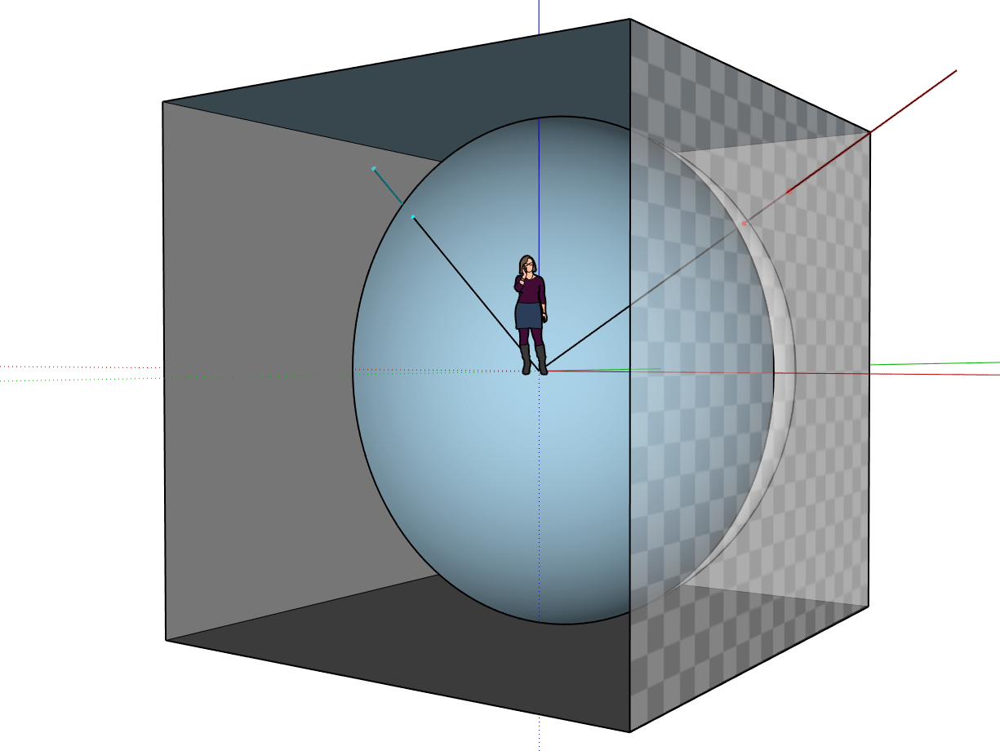
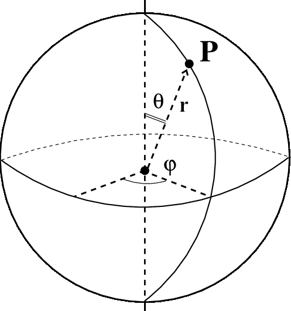
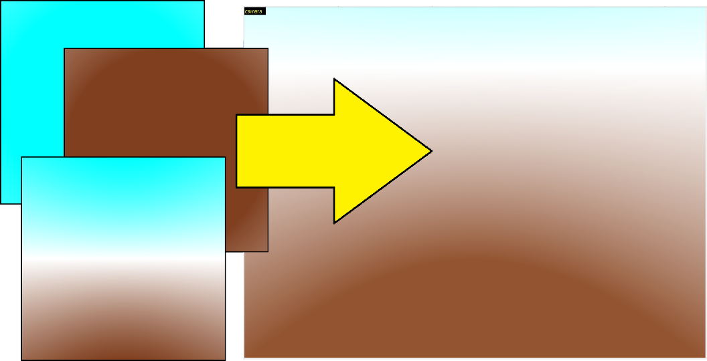
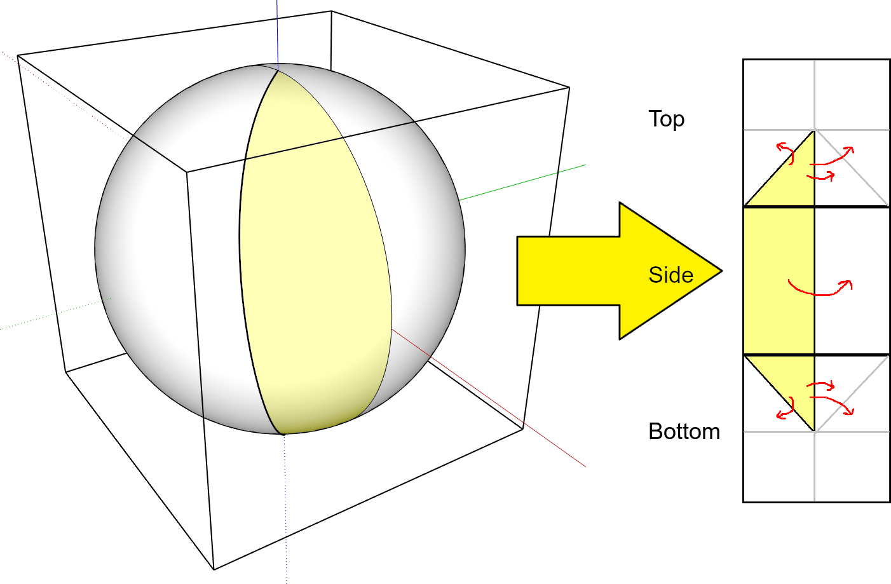

# GradientSkybox
Greg Kennedy, 2020

Generate skyboxes (cube maps) of a gradient sky sphere

## Overview
This is a tool to generate skyboxes - aka "cube maps" - for 3d applications. The output is a set of three square images that make up faces of a cube (top, side, bottom). The input to the program defines a color gradient, with color definitions for 0 and 180 degrees, as well as any number of intermediate angles plus colors. All other color values are interpolated from these and projected to the outside walls, giving an illusion of being inside a sphere or dome.

To use, run `./main.pl AAAAAA BBBBBB` where `AAAAAA` is the RGB hex color for zero degrees (top of the sky), and `BBBBBB` is the RGB hex color for 180 degrees (bottom of the floor).

Intermediate stops can be specified by adding more colors of the format `CCCCCC:angle` where CCCCCC is the desired color and `angle` is the degree value on the sphere that should use the color. 90 degrees is the equator of the sphere (or horizon, when used), while values less than 90 are "in the sky" and above 90 are "on the ground".

Sharp transitions can be produced by placing two stops of a different color very close together, while large bands of the same color use two same-colored stops further apart.

Output files are 24-bit RGB images named UP.PPM, FRONT.PPM, and DOWN.PPM written to the current folder. Users should use an image editor to convert these to the appropriate format (png, jpg, etc), and also copy FRONT.PPM to create the other three sides of the cubemap.

As an extreme example, this command:

    ./main.pl 000000 000000:14.5 FFFF00:15 000000:15.5 000000:45 FF00FF:90 00FF00

will produce this output:

Advanced options (changing the size of the maps, supersampling) are changed by editing the constant definitions at the top of the script.

## Details
A cube map is a 6-sided box used in 3d work (games, VR, rendering etc) to efficiently simulate infinitely far-away background objects. In practice, the user is surrounded by a cube on which each face holds a different texture - as though taken by a 90 degree FOV camera. Then, the normal world geometry is translated and rendered over the sky. Since the cube is always rendered at the same distance from the camera, while the foreground objects move in response to camera repositioning, it gives an illusion of unreachable skies, mountains, etc.

Recently I needed a gradient sky for a game level. Unfortunately, it isn't as direct as just creating a straight line gradient on the sides. Because of the perspective correction of the camera, it is immediately apparent that the user is surrounded by a box: the distant edges are visible as they are technically further from the camera than the center point of the sides.

What I need to do is perform a "projection" of the desired colors onto the wall textures, so that in the game, the illusion of a round dome sky will hide the corners and edges of the box. Essentially, we pre-distort the image of a spherical sky, so that when it's drawn back to us, it appears un-distorted. The distortion of the sides resembles a pincushion, with the edges enlarged to counteract the distant perspective of the camera.

There are programs to take an input square image and distort it, but this seemed backwards: why start with a square image and shift the pixels around, rather than just drawing the image right to begin with? If the pattern is simple enough (here: a gradient on latitudes), it should be possible to do the translation in a generator for greater accuracy - and I could tweak the input values quickly.

The math behind this is as follows: Imagine a person standing in the center of a cube, with each wall 1 unit away. Within that cube we place a surrounding sphere, radius 1 unit, which defines how we "want" the sky to look. Now, for every point on the outside, trace a ray from the origin (0, 0, 0) to the pixel on the cube we want to color in. The line will pass through the sphere at a certain angle and height on its way to reach the cube face. Assign the color of the pixel to the same color from the sphere. In other words: each ray leaves the center outwards, "picks up" the color from the sphere, and carries it to the cube side, where it is "dropped off" to paint it.

Casting one ray for every pixel on the cube face will eventually paint the entire cube. A 256x256 square texture on each cube face (total 6 sides) needs 393,216 rays.

How to get the color at that point on the sphere? Imagine the sphere as a globe, where different paints have been drawn in rings around it. If you know the angle (latitude), you know the color - no other angle matters (latitude). With that knowledge we turn this to a geometry problem - Given an X, Y, Z coordinate (point on cube we want to paint), we first translate to angles from a sphere - that is, converting "cartesian" to "spherical coordinates". Discard the radius and one angle (phi), as we need only the polar (theta) angle to figure out the color for this point.

The last step is to interpolate between the nearest color stops. This is linear interpolation and well-explained elsewhere. The resulting color from the sphere is used to paint the pixel on the output texture.

The resulting textures, when flattened, are now imported into the application and form the illusion of a surrounding sphere.

## Optimizations
The majority of time in the process is spent on trig calculations for every angle. Fortunately, some steps can be skipped to save on time:

* All four cube sides are identical. We need only trace one side, then copy it four times, to have all four sides.
* The left half of the side is a mirror of the right side. Casting one ray covers two pixels, cutting the number of calculations in half.
* For top and bottom, it can be seen that only 1/8 of the image needs to be traced (from 0 to 45 degrees) - a triangle from corner, center, and midpoint. All other seven triangles can be filled by mirrors or rotations.

From a 3d perspective, this is equivalent to casting rays for only a 1/8 slice of the sphere / cube, and then repeating the values to fill out the rest of the textures.

## License
This software is released under CC0 and is public domain software. No rights reserved.
